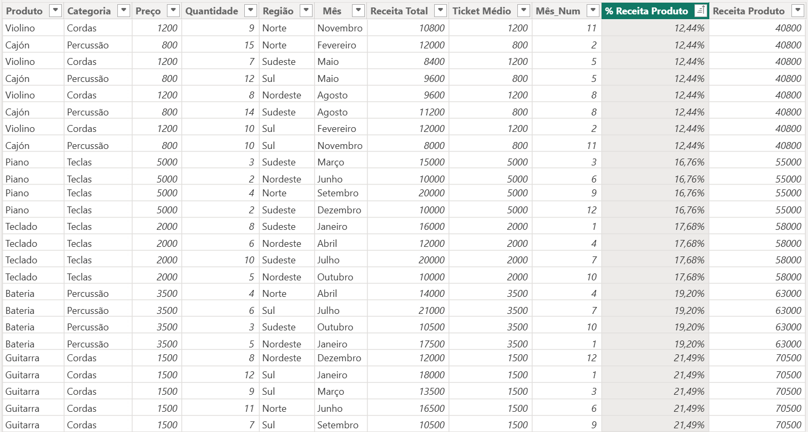

# Harmonia Music Store Project - ETL Pipeline

Este projeto demonstra a construção de um **pipeline ETL (Extract, Transform, Load)** aplicado aos dados da loja fictícia *Harmonia Music Store*.  
O objetivo é mostrar como organizar o fluxo de dados em etapas claras e reproduzíveis, desde a extração até a exportação para análise.

---

## ✨ Autor 
- Paulo V. R. Souza
- LinkedIn: paulovrsouza
- GitHub: vaiprogramarpaulo

---

## 🎯 Objetivo
- Consolidar dados brutos em um formato limpo e estruturado.
- Criar colunas derivadas que auxiliem na análise (ex.: Ticket Médio, ordenação de meses).
- Exportar os dados tratados para arquivos CSV e Excel, prontos para uso em ferramentas como Power BI.
- Demonstrar boas práticas de organização de código em Python.

---

## ⚙️ Estrutura do Pipeline
O pipeline segue três etapas principais:

1. **Extract (Extração)**  
   - Leitura dos dados brutos a partir de um arquivo CSV.

2. **Transform (Transformação)**  
   - Limpeza de linhas nulas e duplicadas.  
   - Criação de colunas derivadas (`Mês_Num`, `Ticket Médio`).  
   - Ajuste estético do índice para começar em 1.

3. **Load (Carregamento)**  
   - Exportação dos dados tratados para novos arquivos CSV e Excel.

---

## 📂 Arquivos do Repositório
- `notebooks/harmonia_music_store.ipynb` → Notebook Jupyter com o código completo  
- `data/harmonia_music_store.csv` → Arquivo de dados brutos (entrada)  
- `output/harmonia_music_store_tratado.csv` → Dados tratados em CSV  
- `output/harmonia_music_store_tratado.xlsx` → Dados tratados em Excel  
- `README.md` → Documento explicativo do projeto  
- `pipeline_visual_hms.pdf` -> (opcional) Fluxograma visual do processo ETL

---

## 🚀 Como Executar
1. Clone este repositório:
   ```bash
   git clone https://github.com/vaiprogramarpaulo/harmonia-music-store-etl.git
   cd harmonia-music-store-etl
2. Abra o Jupyter Notebook:
	```bash
   jupyter notebook
3. Execute o arquivo:
	```bash
   notebooks/harmonia_music_store.ipynb
---

## 📊 Resultados
Após a execução do pipeline, os dados ficam prontos para análise em ferramentas de BI.
Exemplo de colunas criadas:
- Mês_Num → facilita ordenação cronológica.
- Ticket Médio → permite avaliar o valor médio por venda.

Prévia dos dados tratados: 
| Produto | Mês       | Quantidade | Receita Total | Ticket Médio |
|---------|-----------|------------|----------------|---------------|
| Violão  | Janeiro   | 10         | 5000           | 500.0         |
| Piano   | Fevereiro | 5          | 15000          | 3000.0        |

## 🖼️ Dashboard Básico em Power BI

### Medidas DAX
- **Faturamento (Receita Total)**
  `Receita Total = SUM(Sheet1[Receita Total])`

- **Ticket Médio**
  `Ticket Médio = DIVIDE(Sheet1[Receita Total], Sheet1[Total de Vendas])`

- **Total de Vendas**
  `Total de Vendas = SUM(Sheet1[Quantidade])`

### Visualizações

- Cards: Faturamento, Ticket Médio, Total de Vendas
- Gráfico de Linhas: Variação da Receita ao longo dos meses (ordenados cronologicamente)

### Ajustes no Power Query


- Criada tabela auxiliar `MesesMap` com colunas `Mês` e `Mês_Num`
- Merge realizado com `Sheet1` para trazer `Mês_Num`
- Definido `Sheet1[Mês_Num]` como classificado por ordem crescente
- Definido `Sheet1[Mês]` como classificado por `Sheet1[Mês_Num]`

### Como reproduzir
1. Abra o arquivo `.pbix` em Power BI
2. Verifique se `Sheet1[Mês]` está classificada por `Sheet1[Mês_Num]`
3. Explore os cards e o gráfico de variação da receita

---

# Projeto Power BI - DAX Avançado Versão 1


## Descrição
Projeto de portifólio demonstrando medidas DAX para análise de receita por produto e validação visual em relatório Power BI.

## Nota sobre o dataset utilizado
**Dados:** dataset hipotético usado para demonstração; não contém informações reais.

## Evidências e imagens incluídas
- Dashboard principal: 
- Validação Receita por Produto com Card: 
- Power Query MesesMap e Merge: ; 
- Imagem com as colunas `Produto`, `Receita Produto` e `% Receita Produto`: 

- Rank por Produto: 
- Receita por Ticket Bucket: 

### Medidas DAX Implementadas 
 **Receita Total:** `Receita Total = SUM(Sheet1[Receita Total])`  
 **- Responde:** total de receita no dataset.  
 **- Como validar:** comparar com card de soma no dashboard.

**Receita Produto Medida:** `Receita Produto Medida = CALCULATE(SUM('Sheet1'[Receita Total]), VALUES(Sheet1[Produto]))`  
**- Responde:** receita agregada por produto no contexto do visual.    
**- Como validar:** tabela `Produto` + `Receita Produto`; soma de `Receita Produto` por todos os produtos = `Receita Total`. Ver `docs/percent_total_with_card.png`

**% Receita Produto:** `% Receita Produto = DIVIDE([Receita Produto], CALCULATE('Sheet1'[Soma Receita Total], ALL('Sheet1')), 0)`  
**- Responde:** impacto e participação de cada produto na receita total.  
**- Como validar:** soma das participações ≈ 100%. Ver `docs/percent-total_with_card.png`.

**Rank Produto Receita:** `% Rank Produto Receita = RANKX(VALUES('Sheet1'[Produto]), [Receita Produto Medida], , DESC, DENSE)`  
**- Responde:** posição de cada produto por receita (1 = maior receita).  
**- Como validar:** soma das participações ≈ 100%. Ver docs/rank-total.png.

**Ticket Bucket:** 


